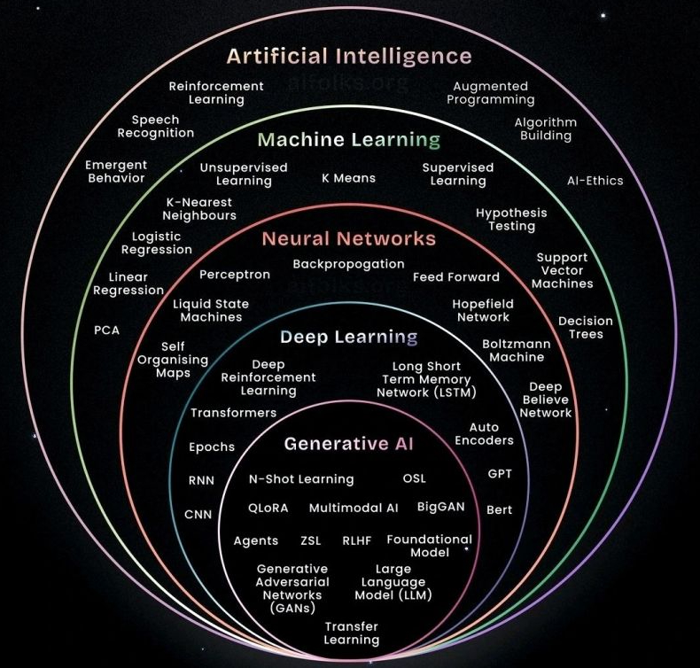

# Large Language Models
Many consider LLMs to work as sort of co-intelligence, augmenting and potentially even replacing human thinking.

We will forgo discussions pertaining to teaching.  Instead, we'll limit our perspectives to our own training as ever-learning scientists.

It's a brave new world out there, so let's talk about it.

***

### Required readings (_before class_)
[Binz et al. 2025. How should the advancement of large language models affect the practice of science?](../../readings/pdfs/Binz2025.pdf)

[Keck et al. 2025. Extracting massive ecological data on state and interactions of species using large language models.](../../readings/pdfs/Keck2025.pdf)

### To do (_before class_)
* Watch [LLMs for Curious Beginners](https://www.3blue1brown.com/lessons/mini-llm) (_8 min._)
* Prepare for assigned discussion (_do the reading and see below!_)

### Class structure

#### 1.  What are we even talking about?
* What are LLMs?
	* AI vs. Machine Learning vs. LLMs
* How do they work?
	* Classification + neural networks + transformers

#### 2. Case Study - Literature classification
* API keys
* Prompt writing

#### 3. Discussion
* I'll assign each of you to represent the perspective of one of the groups in the Bintz et al. paper. 
*  Considerations
	* Crutch vs. tool (efficiency, creativity, ...)
	* Scientific ethics
	* Environmental impacts

***

### Additional resources
* [3Blue1Brown series on Neural Networks](https://www.3blue1brown.com/topics/neural-networks)
* [Hugging Face](https://huggingface.co)

  
### Additional readings

#### General literature & reviews

#### Foundational papers

***
### Potential future case studies
* Coding
* Writing
* Literature review & paper summaries
* Literature classification & data extraction
* Image generation (for talks)
* Image classification
* Data generation
* Data imputation and prediction

